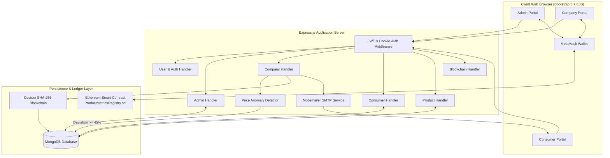

# 🛒 Market Monitoring System

A decentralized and transparent supply chain and market monitoring platform built to prevent price gouging, ensure product authenticity, audit supply chain transactions via dual-layer blockchain technology, and streamline consumer complaint resolution.

---

## 📑 Table of Contents

- [Overview](#-overview)
- [Key Features](#-key-features)
- [System Architecture](#-system-architecture)
- [Role-Based Workflows](#-role-based-workflows)
  - [1. Admin](#1-admin)
  - [2. Company](#2-company)
  - [3. Consumer](#3-consumer)
- [Dual-Layer Blockchain Ledger](#-dual-layer-blockchain-ledger)
  - [Ethereum Smart Contract](#ethereum-smart-contract-productmetricsregistrysol)
  - [Custom SHA-256 Ledger](#custom-sha-256-mongodb--in-memory-blockchain)
- [Automated Price Anomaly Detection](#-automated-price-anomaly-detection)
- [Tech Stack](#-tech-stack)
- [Project Directory Structure](#-project-directory-structure)
- [Getting Started](#-getting-started)
  - [Prerequisites](#prerequisites)
  - [Environment Configuration](#environment-configuration)
  - [Local Installation & Execution](#local-installation--execution)
  - [Docker Setup](#docker-setup)
- [Smart Contract Deployment](#-smart-contract-deployment)
- [API & Route Directory](#-api--route-directory)
- [License](#-license)

---

## 🌟 Overview

In complex multi-tier supply chains, tracking product provenance and preventing illicit pricing manipulation or counterfeit goods is a major challenge. The **Market Monitoring System** addresses this by combining **Ethereum smart contracts**, a **custom cryptographically-linked ledger**, **MongoDB persistence**, and a **role-based web portal**.

It empowers:
- **Regulators and Admins** to detect price manipulation instantly through automated anomaly alerts and verify immutable audit trails.
- **Supply Chain Companies** to securely record stock provenance, transfer products to verified peers, and address consumer inquiries.
- **Consumers** to trace product journeys, inspect historical margins, and lodge formal complaints with automated email notification updates.

---

## 🚀 Key Features

- **🔐 Dual Blockchain Architecture**:
  - **On-chain**: Ethereum smart contract (`ProductMetricsRegistry.sol`) logs inter-company transfer metrics and enforces participant whitelisting via MetaMask.
  - **Off-chain**: Internal SHA-256 cryptographically chained ledger stored in MongoDB with Genesis block creation and instant chain integrity validation (`/blockchain/validate`).
- **📈 Automated Price Anomaly Detection**:
  - Calculates real-time price deviations when products are transferred between supply chain partners.
  - Automatically flags an **Alert** whenever a selling price deviates by **$\ge 45\%$** or **$\le -45\%$** from the product's base price ($Selling \ge Base \times 1.45$ or $Selling \le Base \times 0.55$).
- **👥 Role-Based Access Control (RBAC)**:
  - Separate authenticated dashboards and middleware guards for **Admin**, **Company**, and **Consumer** roles using JWT stored in secure `httpOnly` cookies.
- **📦 Inventory & Composite ID Generation**:
  - Automatically generates sanitized, deterministic composite product IDs (`companyID + batchNumber + sanitizedProductName`) to prevent collisions and simplify tracking across vendors.
- **✉️ Automated Email Notifications**:
  - Nodemailer integrated with responsive EJS email templates (`views/email/complaintResponse.ejs`) to notify consumers immediately when a company responds to their complaint.
- **🐳 Full Containerization**:
  - Ready-to-use `Dockerfile` and `docker-compose.yml` for rapid, consistent deployment.

---

## 🏛 System Architecture



---

## 👤 Role-Based Workflows

### 1. Admin
- **Company Governance**: Register new enterprise participants and revoke access on-chain via the smart contract interface.
- **Chain Validation**: View block details (`/admin/showblockinfo`) and run mathematical validation algorithms (`/blockchain/validate`) to detect tampering.
- **Anomaly & Alert Resolution**: Access the centralized alert log (`/admin/alertlist`) showing vendor names, product IDs, batch numbers, base price vs selling price, and deviation percentage; mark alerts as `Resolved`.
- **Complaint Oversight**: Filter and inspect all consumer complaints across the market (`/admin/complaints`) and adjust statuses.
- **Cross-Market Stock Tracker**: Search any product (`/product/stock`) with case-insensitive pattern matching to see aggregate inventory held by each company.

### 2. Company
- **Product Management**: Register new batches and products with custom base prices and quantities.
- **Supply Chain Product Transfer**: Sell/transfer products to downstream verified businesses:
  - Validates recipient company status.
  - Interacts with MetaMask to sign the Ethereum transaction (`recordProductMetric`).
  - Automatically deducts source inventory and initializes recipient inventory.
  - Appends an immutable block to the custom blockchain ledger.
  - Triggers automated price anomaly detection.
- **Complaint Resolution**: View complaints directed to the company, draft responses, and resolve complaints. Submitting a response triggers an automated email to the consumer.

### 3. Consumer
- **Dashboard**: Track filed complaints and review official company responses in real-time.
- **File Complaints**: Submit detailed grievance tickets against specific companies with issue descriptions.
- **Product Traceability**: Query `/consumer/productmetrics` with a Product Name and Batch Number to audit the full journey, transactions, and selling prices across vendors.

---

## ⛓ Dual-Layer Blockchain Ledger

### Ethereum Smart Contract (`ProductMetricsRegistry.sol`)
Located at `public/contract/blockchain.sol`, this Solidity contract provides trustless decentralized verification:
- **Admin Functions**:
  - `registerCompany(address company)`: Authorizes a company wallet address.
  - `revokeCompany(address company)`: Disables an untrusted or fraudulent participant.
- **Company Functions**:
  - `recordProductMetric(...)`: Logs supply chain sales data (`productID`, `origin`, `toCompanyAddress`, `sellingPrice`, `quantityBought`, `timestamp`). Emits `ProductMetricRecorded`.
- **Public & View Functions**:
  - `getAllMetrics()`: Returns all supply chain entries for external auditing.
  - `isCompany(address)`: Mapping verifying whitelisted corporate addresses.

### Custom SHA-256 MongoDB & In-Memory Blockchain
Located in `blockchain.js`, this provides an independent, zero-gas internal audit trail:
- **Genesis Block**: Auto-generated upon server startup if no chain exists.
- **Block Structure**:
  ```json
  {
    "index": 1,
    "timestamp": 1725494400000,
    "data": { ...metricsData },
    "previousHash": "0000a4b7...",
    "hash": "c83b4e12..."
  }
  ```
- **Hashing**: SHA-256 computed over `data + timestamp`.
- **Verification (`isValid()`)**: Iterates through the chain verifying that current block hash matches recalculation and `previousHash` matches the prior block's hash.

---

## 🚨 Automated Price Anomaly Detection

To prevent price gouging and unfair market manipulation, the system monitors sales between supply chain participants:

$$\text{Deviation} = |\text{Selling Price} - \text{Base Price}|$$

When a company submits a product transfer via `/company/submit-product`:
```javascript
const base = product.basePrice;
const sold = Number(sellingPrice);

if (sold >= base * 1.45 || sold <= base * 0.55) {
  const deviation = Math.abs(sold - base);
  await Alert.create({
    metricsId: newProductMetrics._id,
    productID,
    sellingPrice: sold,
    basePrice: base,
    deviation,
    status: 'Flagged'
  });
}
```
Any trade with **$\ge 45\%$ markup or discount** creates a high-priority `Flagged` alert visible on the Admin dashboard for regulatory intervention.

---

## 🛠 Tech Stack

| Domain | Technology |
|---|---|
| **Runtime & Backend** | [Node.js](https://nodejs.org/) (v18+) & [Express.js](https://expressjs.com/) |
| **Database & ODM** | [MongoDB](https://www.mongodb.com/) with [Mongoose](https://mongoosejs.com/) |
| **Blockchain (Web3)** | [Solidity](https://soliditylang.org/) `^0.8.0`, [Ethers.js](https://docs.ethers.org/), [MetaMask](https://metamask.io/) |
| **Internal Ledger** | Custom Node.js SHA-256 Hash Chain (`crypto`) |
| **Security & Auth** | [JSON Web Tokens (JWT)](https://jwt.io/), [bcryptjs](https://github.com/dcodeIO/bcrypt.js), `cookie-parser` |
| **Frontend & UI** | [EJS Templates](https://ejs.co/), [Bootstrap 5](https://getbootstrap.com/), Vanilla CSS |
| **Email Service** | [Nodemailer](https://nodemailer.com/) with HTML EJS layouts |
| **Containerization** | [Docker](https://www.docker.com/) & Docker Compose |

---

## 📂 Project Directory Structure

```text
market-monitoring-system/
├── blockchain.js                 # Custom SHA-256 blockchain implementation
├── db.js                         # MongoDB connection configuration
├── Dockerfile                    # Container build configuration
├── docker-compose.yml            # Docker multi-container specification
├── index.js                      # Application entry point & route registration
├── package.json                  # Dependencies and project scripts
├── .env.example                  # Template for environment variables
├── middlewares/
│   └── authMiddleware.js         # JWT authentication & role-based guards
├── public/
│   ├── contract/
│   │   └── blockchain.sol        # Solidity smart contract (ProductMetricsRegistry)
│   ├── css/                      # Custom stylesheets for dashboards
│   └── json/
│       └── abi.json              # Smart contract ABI definition
├── routeHandler/
│   ├── adminHandler.js           # Admin routes: alerts, stock, approvals, audits
│   ├── blockChainHandler.js      # Blockchain endpoints & validation
│   ├── companyHandler.js         # Company product transfer, metrics & complaints
│   ├── consumerHandler.js        # Consumer complaints & transparency metrics
│   ├── productHandler.js         # Product inventory & stock search routes
│   └── userHandler.js           # Authentication (signup, login, logout)
├── schemas/
│   ├── alertSchema.js            # Anomaly alert data model
│   ├── block.js                  # Custom blockchain block schema
│   ├── complaintSchema.js        # Consumer complaint ticket schema
│   ├── productMetricsSchema.js   # Inter-company product metric records
│   ├── productSchema.js          # Product inventory model
│   └── userSchema.js             # User accounts with roles & company profiles
└── views/
    ├── addCompany.ejs            # Admin: Register company form
    ├── addProduct.ejs            # Company: Add product form
    ├── adminDashboard.ejs        # Admin: Central control panel
    ├── adminStockDetails.ejs     # Admin: Market-wide inventory search
    ├── alertList.ejs             # Admin: Price anomaly alerts overview
    ├── companyDashboard.ejs      # Company: Inventory & metrics dashboard
    ├── company_showComplaints.ejs# Company: Complaint response panel
    ├── consumerDashboard.ejs     # Consumer: Ticket tracking dashboard
    ├── email/
    │   └── complaintResponse.ejs # Nodemailer HTML email layout
    ├── errorHandler.ejs          # Standardized error page
    ├── isRegistered.ejs          # Smart contract verification view
    ├── login.ejs / signup.ejs    # Authentication views
    ├── partials/                 # Reusable navbars, headers, and footers
    ├── productMetrics.ejs        # Traceability & metrics viewer
    ├── productMetricsForm.ejs    # Company: Product transfer & Web3 submission
    ├── revokecompany.ejs         # Admin: Revoke company authorization view
    ├── showBlockInfo.ejs         # Blockchain block inspection view
    ├── showComplaints.ejs        # Admin: Complaint management view
    ├── showMetrics.ejs           # Smart contract metrics display
    └── submitComplaint.ejs       # Consumer: Lodge complaint form
```

---

## 🏁 Getting Started

### Prerequisites

- [Node.js](https://nodejs.org/) (version 18 or higher recommended)
- [MongoDB](https://www.mongodb.com/) running locally on port `27017` (or via Docker/Atlas)
- [MetaMask](https://metamask.io/) browser extension connected to an Ethereum testnet (e.g., Sepolia or Ganache) for smart contract interactions
- SMTP credentials (e.g., Gmail, Hostinger, Mailgun, or Ethereal for testing)

### Environment Configuration

1. Clone the repository:
   ```bash
   git clone https://github.com/B1nturi/market-monitoring-system.git
   cd market-monitoring-system
   ```

2. Copy the sample environment file and configure your values:
   ```bash
   cp .env.example .env
   ```

3. Update `.env` with your settings:
   ```env
   PORT=3000
   JWT_SECRET=your_super_secret_jwt_key
   CONTRACT_ADDRESS=0xYourDeployedContractAddressHere

   # SMTP settings for Nodemailer
   SMTP_HOST=smtp.example.com
   SMTP_PORT=587
   SMTP_SECURE=false
   SMTP_USER=your_email@example.com
   SMTP_PASS=your_email_password_or_app_token
   SMTP_FROM="Market Monitoring System <support@example.com>"
   ```

### Local Installation & Execution

1. Install dependencies:
   ```bash
   npm install
   ```

2. Start the MongoDB service if it isn't running:
   ```bash
   # Windows (PowerShell / Service)
   net start MongoDB
   
   # Linux / macOS
   sudo systemctl start mongod
   ```

3. Start the application in development mode (with auto-reload):
   ```bash
   npm start
   ```
   Or in production mode:
   ```bash
   npm run prod
   ```

4. Open your browser and navigate to:
   ```
   http://localhost:3000
   ```

### Docker Setup

You can run the application seamlessly inside Docker containers:

1. Build and run using Docker Compose:
   ```bash
   docker-compose up --build
   ```

2. The application will be live at `http://localhost:3000`.

---

## 📜 Smart Contract Deployment

1. Open [Remix Ethereum IDE](https://remix.ethereum.org/).
2. Create a new file `ProductMetricsRegistry.sol` and copy the code from:
   ```
   public/contract/blockchain.sol
   ```
3. Compile using Solidity compiler version `^0.8.0`.
4. Deploy to your desired network (e.g., Sepolia, Hardhat, or Ganache local testnet).
5. Copy the deployed contract address and set it as `CONTRACT_ADDRESS` in your `.env` file.
6. If the contract ABI changes, update `public/json/abi.json`.

---

## 🛣 API & Route Directory

### Authentication & Users (`/user`)
| Method | Route | Description | Access |
|---|---|---|---|
| `GET` | `/user/signup` | Render signup view | Public |
| `POST` | `/user/signup` | Register new account (`admin`, `company`, `consumer`) | Public |
| `GET` | `/user/login` | Render login view | Public |
| `POST` | `/user/login` | Authenticate user & set JWT cookie | Public |

### Admin Operations (`/admin`)
| Method | Route | Description | Access |
|---|---|---|---|
| `GET` | `/admin/dashboard` | Main admin overview and statistics | Admin |
| `GET` | `/admin/showblockinfo` | Inspect recent blocks from the custom blockchain | Admin |
| `GET` | `/admin/addcompany` | View interface to whitelist company on smart contract | Admin |
| `GET` | `/admin/revokecompany` | View interface to revoke company from smart contract | Admin |
| `GET` | `/admin/companies` | JSON list of all registered companies | Admin |
| `GET` | `/admin/complaints` | View and filter all consumer complaints | Admin |
| `POST` | `/admin/updateComplaintStatus` | Update complaint status | Admin |
| `GET` | `/admin/alertlist` | View flagged price anomaly alerts | Admin |
| `POST` | `/admin/alert/:id/resolve` | Mark price anomaly alert as Resolved | Admin |
| `GET` | `/admin/showmetrics` | Render on-chain smart contract metrics view | Admin |

### Company Operations (`/company`)
| Method | Route | Description | Access |
|---|---|---|---|
| `GET` | `/company/dashboard` | Company dashboard, inventory & wallet view | Company |
| `GET` | `/company/submit-product` | Form to transfer stock to another company | Company |
| `POST` | `/company/submit-product` | Execute transfer, log metric, check anomaly & add block | Company |
| `GET` | `/company/complaints` | View complaints targeted at this company | Company |
| `POST` | `/company/respond/:id` | Submit response to complaint & send email to consumer | Company |
| `GET` | `/company/productmetrics` | View supply chain transaction history | Company |

### Consumer Operations (`/consumer`)
| Method | Route | Description | Access |
|---|---|---|---|
| `GET` | `/consumer/dashboard` | Consumer dashboard with submitted complaints | Consumer |
| `GET` | `/consumer/submit-complaint` | Render complaint submission form | Consumer |
| `POST` | `/consumer/submit-complaint` | File a new complaint against a company | Consumer |
| `POST` | `/consumer/resolve-complaint/:id` | Mark an existing complaint as Resolved | Consumer |
| `GET` | `/consumer/productmetrics` | Public traceability lookup with filters | Consumer |

### Product Management (`/product`)
| Method | Route | Description | Access |
|---|---|---|---|
| `GET` | `/product/add` | Render add product form | Company |
| `POST` | `/product/create` | Create new product batch with composite ID | Company |
| `GET` | `/product/stock` | Admin product stock lookup view | Admin |
| `GET` | `/product/stock/:productName` | Aggregated stock counts grouped by company | Admin |
| `GET` | `/product/search` | Autocomplete product search endpoint | Admin |
| `GET` | `/product/myproducts` | Fetch all products owned by current company | Company |
| `POST` | `/product/edit/:productID` | Update product details | Company |
| `POST` | `/product/delete/:productID` | Delete product from company inventory | Company |

### Blockchain & Verification (`/blockchain`)
| Method | Route | Description | Access |
|---|---|---|---|
| `GET` | `/blockchain` | Fetch full custom blockchain ledger in JSON format | Admin |
| `POST` | `/blockchain/add-block` | Manually append a block to the custom chain | Company |
| `GET` | `/blockchain/validate` | Cryptographically verify validity of block hashes | Admin |

---

## 📄 License

This project is licensed under the [MIT License](LICENSE) (or open source). Feel free to adapt and expand for your market monitoring and supply chain requirements.
